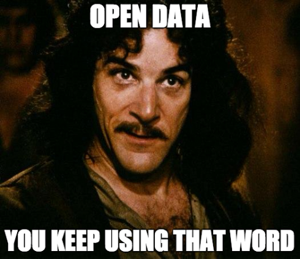
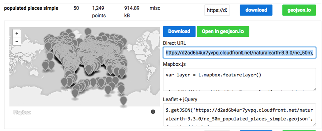
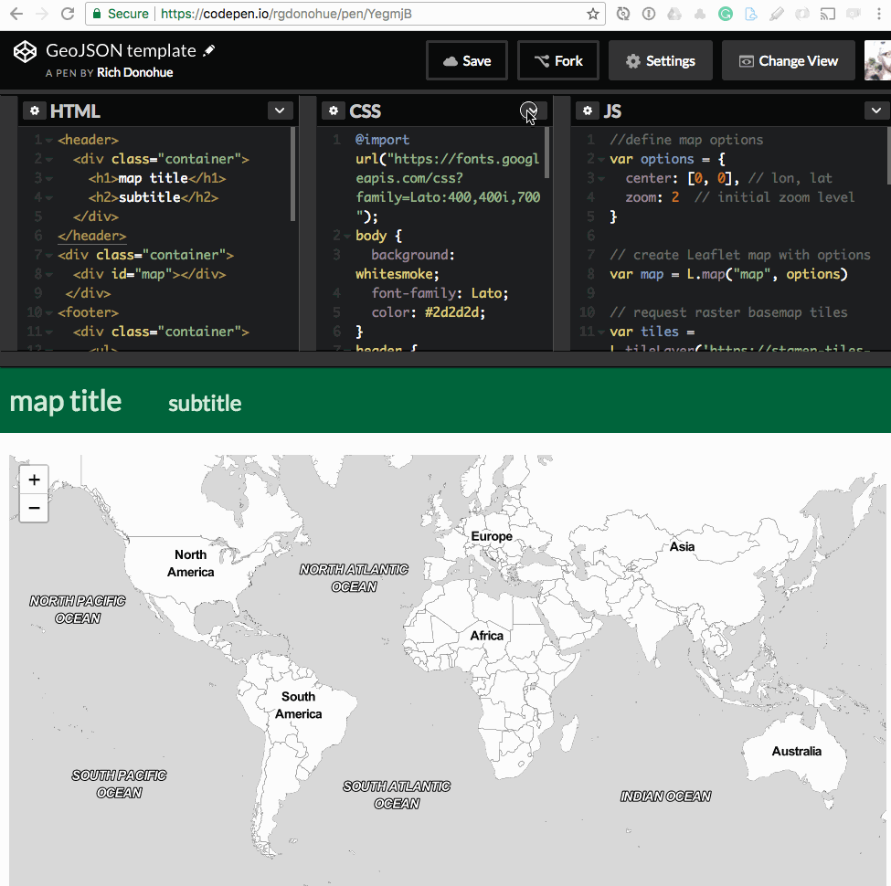
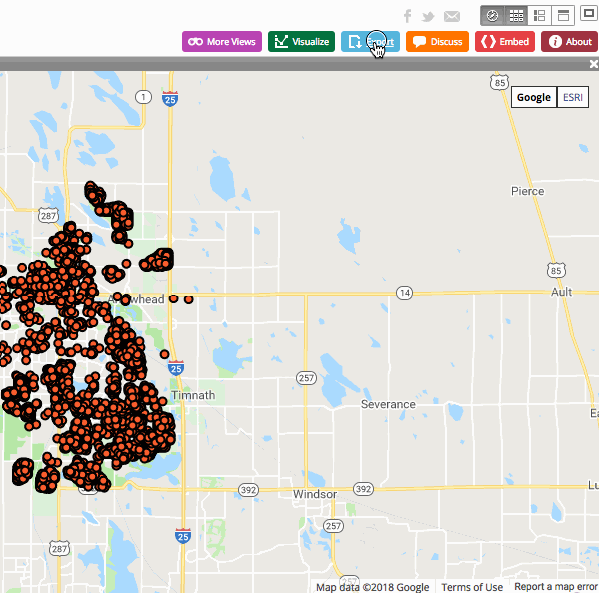
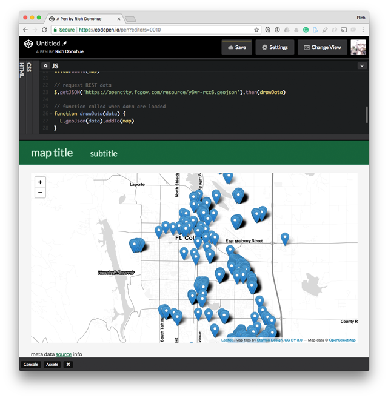
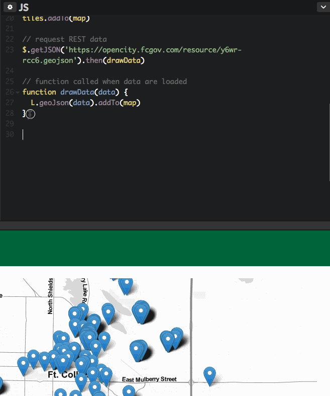
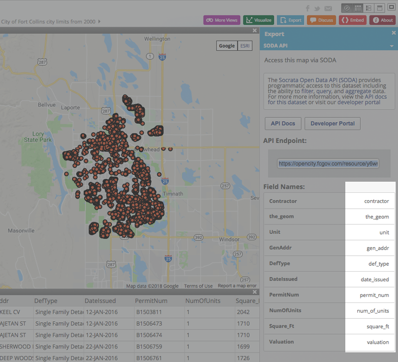

# Open Data Day 2018

This repository houses information for the CSU Centroid's sponsored [Open Data Day 2018](http://opendataday.org/), to be held on Friday, March 2nd from 2 - 5 pm (174 Morgan Library).

 

## Workshop overview

This hands-on workshop celebrates open data and mapping through an exploration of publicly-accessible portals and web services. We'll begin with an overview of open data, licensing, and use. Workshop participants will learn how to construct a basic web map using [CodePen](https://codepen.io/) and [Leaflet](http://leafletjs.com/), the popular open-source JavaScript mapping library. We'll then practice requesting various data layers for integration with the map. The workshop will conclude with considerations for future steps for enhanced representation and interaction for mapping with open data.

### Learning objectives

By the end of this workshop, participants will be able to:

* identify sources for acquiring open data
* understand open data licenses and the implications for their use (non-profit/commercial, etc.)
* demonstrate the ability to build a basic web map using HTML, CSS, and JavaScript (templates provided)
* access and retrieve open data layers and services using API keys and REST services
* request geospatial data stored as GeoJSON and add it to the map

### Expected background and requirements

This workshop is intended to be accessible to anyone interested in learning about open data and mapping (aka open to "newbies"). We expect no prior technical background and will demonstrate coding processes and provide examples and templates.

The workshop will provide computers for use, though you're encouraged to bring your own laptop if you wish. It is also recommended you create a [GitHub account](https://github.com/) if you haven't already, as well as an account on [CodePen](https://codepen.io/), prior to the workshop.

We may have you quickly create new accounts to access data and API keys, so have your favorite username and passwords handy.

## Getting started

**Instructions:**

* Follow along with the instructor and the documentation for the workshop outlined below
* Open the [collaborative notes for Open Data Day 2018](https://docs.google.com/document/d/1RHppW-e5ySZ2P-GnFFF_-O4uBUADThMUTnssFMYi3kk/edit?usp=sharing) and edit the document with ideas, links to resources, and questions
* Create a free [GitHub account](https://github.com/) if you don't have one (tip: choose a professional username consistent with your LinkedIn, social media handles, etc.)

**Outline for the workshop:**

* Introductions:
  * Guest instructors and sponsors
  * Workshop participants
  * Open data and Open Data Day
* Open data and Open Data Day
* Finding 

### About the guest instructor

[Rich Donohue](https://github.com/rgdonohue) is a postdoctoral scholar at the University Kentucky's Department of Geography. He is a curriculum designer and instructor for [New Maps Plus](https://newmapsplus.uky.edu/), an online program in Web GIS and Mapping. He studied Cartography at the UW-Madison, where his research focused on teaching mapping with web standards.

### About the workshop participants

You completed a brief survey when registering. Here is what you told us you do or who you are:

  
**Figure 01.** Responses from workshop participants: role.

You also told us about your experience with various mapping tools:

  
**Figure 02.** Responses from workshop participants: experience.

**Quick introductions:** Briefly (20 seconds max each!) go around the room and introduce ourselves:

* what's your first name?
* what kind of map would you like to map with open data?

### Open data and Open Data Day

We're here to celebrate Open Data through [Open Data Day 2018](http://opendataday.org/).

  
**Figure 03.** [Open Data Day 2018](http://opendataday.org/).

There are many forms that open data take and many activities, priorities, and goals associated with open data. To get a better sense, peruse the registered events on the [Open Data Day map](http://opendataday.org/) or read Tweets posted with the [#OpenDataDay hashtag](https://twitter.com/search?q=%23OpenDataDay&src=tyah).

For some, open data needs to be freely accessible by all. For others, open data is about connecting civic engagement with governmental data sources. The meaning of open data shifts being binaries of public/private, fun/tactical, crowd-sourced/niche, GeoJSON/Shapefile, etc.

**Question:** But really, what is open data?

  
**Figure 04.** Inigo Montoya asking what open data means.

Seriously, I don't know what open data is. As lively as a full-blown discussion about what it may or may not be, perhaps that's something to leave for post-workshop geobeers?

## Finding and using open data

Obviously, we do not lack in available data. In fact, we're drowning in data. It's essential to document available data sources and to critically examine their purpose, who funded them, their quality, and the "rights" of citizens to access them.

**A few open data sources**:

* https://data.world/
* https://www.data.gov/
* http://data.opengeoportal.org/
* http://www.naturalearthdata.com/downloads/
* https://www.census.gov/geo/maps-data/data/tiger-cart-boundary.html
* https://hub.arcgis.com/pages/open-data
* https://earthexplorer.usgs.gov/
* http://overpass-turbo.eu/
* https://download.geofabrik.de/
* http://sedac.ciesin.columbia.edu/
* http://www.opentopography.org/
* http://data.opengeoportal.org/

### The boring but necessary part: licenses

Whether we're creating open data or using it, it's important to be aware of the legal and licensing restrictions of data.

* https://project-open-data.cio.gov/open-licenses/
* http://opendefinition.org/guide/data/

While the "what is open data?" and "where do we get open data?" and "how can use open data?" questions are all important, this workshop will focus more on the "how can I use open data with open source web mapping?" Let's now turn to that question.

## Introduction to open web mapping with Leaflet.js

Today we're going to introduce you to open source web mapping briefly. There are many exciting mapping tools and libraries to explore. We'll be using [Leaflet](http://leafletjs.com/), the "leading open-source JavaScript library for mobile-friendly interactive maps."

  
**Figure 05.** Leaflet logo.

Before we learn a little bit about making web maps with Leaflet, we need to establish a "development environment" and learn some basics of web standards. While being a mapper ten or fifteen years ago meant fluency using desktop GISs, zip files, and perhaps Adobe Illustrator, today it increasingly means understanding how the web works through web standards such as HTML/SVG, CSS, and JavaScript.

### Codepen: a Web-based development environment

Typically web designers, developers, and mappers build applications using a [local development environment](https://github.com/rgdonohue/web-mapping-short-course/blob/master/module-01/lesson-01.md#setting-up-a-development-environment) that includes powerful text editors or integrated development environments (IDEs), local web servers, modern web browsers with sophisticated development and debugging tools, and more.

To simplify things today, however, we'll use a development environment housed entirely with the web browser called [CodePen](https://codepen.io/). Dubbed "a social development environment for front-end designers and developers," CodePen allows us to import various resources from the web and write our code to practice web mapping.

  
**Figure 06.** Codepen development interface.

You can create a new account to use Codepen, but it's easier to log in using your GitHub credentials (recommended).

**Task:** Create a new Codepen account (using your GitHub credentials).

Let's get started learning a little bit about web development using Codepen. Login to your Codepen account and choose the option to create a "New Pen."

  
**Figure 07.** Creating a New Pen.

We're now ready to write a little HTML, CSS, and JavaScript.

### Building blocks of web design: HTML, CSS, JS

The designer Paul Rand once wrote that "Design is the method of putting form and content together." He may have been speaking more of static logo design. Today, we can apply this idea to the design of interactive and dynamic web maps and data visualizations.

#### HTML (content)

We write HTML to structure the content of our pages and application. Begin by pasting the following HTML into the leftmost pane within your new Codepen Pen:

```html
<header>
  <div class="container">
    <h1>map title</h1>
    <h2>subtitle</h2>
  </div>
</header>
<div class="container">
  <div id="map"></div>
 </div>
<footer>
  <div class="container">
    <ul>
      <li>meta data <a href="">source</a> info</li>
      <li>meta author, etc</li>
    </ul>
  </div>
</footer>
```

As you can see, Codepen automatically updates the "browser" window at the bottom (you can also hit Save at the top or Cntr-S to save and refresh the window).

  
**Figure 08.** The HTML interactively updated in Codepen.

**Task:** Play around with the HTML within Codepen. Change the values of the text.

We have a valid HTML document now, but it's not very pretty. We need to marry form to our content.

#### CSS (form)

Next, past the following CSS style rules in the second pane:

```css
@import url("https://fonts.googleapis.com/css?family=Lato:400,400i,700");
body {
  background: whitesmoke;
  font-family: Lato;
  color: #2d2d2d;
}
header {
  background: #00643b;
  color: #d4edda;
  padding: 18px 0;
}
footer ul {
  list-style-type: none;
  padding-left: 0;
}
footer li {
  margin-bottom: 6px;
}
footer a {
  color: #00643b;
}
h1 {
  margin: 0 48px 0 0;
  display: inline;
  font-weight: 400;
}
h2{
  display: inline;
  font-weight: 400;
}
.container {
  max-width: 960px;
  margin: 0 auto;
}
#map {
  width: 100%;
  height: 500px;
  margin: 24px 0;
  background: #448ee4;
}
```

Upon saving and updating, you should see the rendered HTML elements update with various style rules:

  
**Figure 09.** CSS style rules applied to the HTML elements.

**Task:** Try playing around with the values of the style rules. Change the colors of the elements. Try adjusting the margins or sizes of the elements.

This is fun! Here we have an interactive environment for playing with the relationship between content and form. 

But the web offers us one more crucial component of design which we need to add to Paul's formula: behavior and interaction. This is where our JavaScript enters the love triangle.

#### JavaScript (behavior and events)

To quickly demonstrate the power of JavaScript, we're going to paste in a JavaScript statement that selects an existing element on our page and dynamically changes it. Write or paste the following JavaScript code into the third pane of the Codepen interface:

```javascript
document.querySelector("h1").innerHTML = "world's best map title"
```

As you can see, the JavaScript code can change the content of the HTML.

  
**Figure 10.** Using JavaScript to select and change an HTML element.

JavaScript is also able to change the form or styles of the HTML elements. Try writing or pasting the following JS code to change the color of the "map" element (values can be common color names or hexadecimal values):

```javascript
document.querySelector("#map").style.background = '#ffa950'
```

We can see how JavaScript can change the styles.

  
**Figure 10.** Using JavaScript to update content and styles dynamically.

All together HTML, CSS, and JavaScript form the foundation for web mapping. Of course, there are many more web standards that come into play (notably SVG, HTML's counterpart for describing graphics). But this should be enough to get us into trouble for the time being.

Next, let's use JavaScript to create a basic Leaflet web map and load some open data tiles from a remote resource.

### Creating a basic Leaflet map with open map tiles

Before we can use Leaflet within our web application, we need to load a couple of external resources into our Pen. If you navigate to the [Leaflet Download page](http://leafletjs.com/download.html), you'll see Leaflet hosts the required CSS and JavaScript on remote CDN's (or Content Delivery Networks).

Note there is a file containing Leaflet's CSS rules (ending with the extension `.css`) and a file containing Leaflet's JavaScript (ending with the extension `.js`):

```html
<link rel="stylesheet" href="https://unpkg.com/leaflet@1.3.1/dist/leaflet.css" />
<script src="https://unpkg.com/leaflet@1.3.1/dist/leaflet.js"></script>
```

We need to first add references to these resources. Within the Codepen interface, access the Pen Settings and paste the URL for the CSS into the CSS tab. Note that you just want to paste the URL: `https://unpkg.com/leaflet@1.3.1/dist/leaflet.css`

  
**Figure 12.** Including the Leaflet CSS in the Codepen interface.

Then do the same thing for the JavaScript: `https://unpkg.com/leaflet@1.3.1/dist/leaflet.js`

  
**Figure 13.** Including the Leaflet JS in the Codepen interface.

We should now be ready to go.

Replace the JavaScript we've already written with the following (note how the code following the two `//` forward slashes are comments that do not get executed when the JavaScript runs).

```javascript
//define map options
var options = {
  center: [40.57, -105.08], // lon, lat
  zoom: 11,  // initial zoom level 
}

// create Leaflet map with options
var map = L.map("map", options)

// request raster basemap tiles
var tiles = L.tileLayer('https://{s}.tile.opentopomap.org/{z}/{x}/{y}.png', {
    maxZoom: 17,
    attribution: 'Map data: &copy; <a href="http://www.openstreetmap.org/copyright">OpenStreetMap</a>, <a href="http://viewfinderpanoramas.org">SRTM</a> | Map style: &copy; <a href="https://opentopomap.org">OpenTopoMap</a> (<a href="https://creativecommons.org/licenses/by-sa/3.0/">CC-BY-SA</a>)'
})

// add the tiles to the map
tiles.addTo(map)
```

If successful, you should see your colored square for our "map" element replaced by a tiled Leaflet-supported slippy map using map tiles from opentopomap.org.

  
**Figure 14.** Leaflet map rendered with opentopo map tiles.

Hurray! You've made your first open web map using open data map tiles.

While we're not going to get deep into writing JavaScript, note the code stored as our `mapOptions`:

```javascript
//define map options
var options = {
  center: [40.57, -105.08], // lon, lat
  zoom: 11,  // initial zoom level
}
```

**Task:** Try adjusting the numeric values for the latitude and longitude of the center of the map, as well as the initial zoom level (0 - 17).

We now have a basic map page template to work with moving forward. If you break your page playing with the HTML/CSS/JavaScript (which you should do), you can access it here:

https://codepen.io/rgdonohue/pen/wyOoyr

You can choose to "Fork" this Pen into your own account for further editing.

### Playing with Layers

Let's now explore some other options for these openly accessible map tiles. Navigate your browser to the following URL:

http://leaflet-extras.github.io/leaflet-providers/preview/

This page provides access to many available map tiles. Clicking on the tile options to the right will supply you with the JavaScript code necessary to request the new tile set. You can then cut and paste this code into your pen, replacing the existing tile layer with the new one.

For instance, we can replace this code within our Pen:

```javascript
L.tileLayer('https://{s}.tile.opentopomap.org/{z}/{x}/{y}.png', {
    maxZoom: 17,
    attribution: 'Map data: &copy; <a href="http://www.openstreetmap.org/copyright">OpenStreetMap</a>, <a href="http://viewfinderpanoramas.org">SRTM</a> | Map style: &copy; <a href="https://opentopomap.org">OpenTopoMap</a> (<a href="https://creativecommons.org/licenses/by-sa/3.0/">CC-BY-SA</a>)'
})
```
With the following code to produce a grayscale version world map tiles.

```javascript
L.tileLayer('http://{s}.tiles.wmflabs.org/bw-mapnik/{z}/{x}/{y}.png', {
    maxZoom: 18,
    attribution: '&copy; <a href="http://www.openstreetmap.org/copyright">OpenStreetMap</a>'
})
```

Saving those changes to our code will produce a new basemap:

  
**Figure 15.** Swapping the basemap in a Leaflet map.

**Task:** Experiment with swapping our various basemaps listed within the Leaflet Providers demo page.

**Note:** We'll be moving away from requesting tile layers now, but if you're an Esri fan you should explore the [Esri Leaflet Plugin](https://github.com/Esri/esri-leaflet) for working with a handful of the most popular ArcGIS Service types.

## Mapping feature data from a REST service

Changing up the basemap is fun, and there are many more layers that we can load as a tileLayer. However, interactive web mapping becomes even more powerful when we can bring in various data source and map them atop a basemap. Let's play with some possibilities for mapping data features now.

**What is RESTful mean and what is a REST API?**

Web mappers, GIS practitioners, and technical people in general love our technologies and especially our techie terms and buzzwords. "REST" is a fun one to throw around to make yourself sound smarter, as is "API."

**REST** stands for Representational state transfer, which refers to an established web architecture making use of HTTP requests. We're all familiar with how REST works through the practice of using the web itself. Essentially:

* You use a web browser (a "client") to make a request to a remote computer (a "server"). Both work independently of one another.
* Unless something breaks, the server returns a response to your request, and that's either useful data or perhaps an error message. Regardless, the server doesn't store any information once it returns the response. The client-server connection isn't ongoing. We refer to this quality as being as "stateless."
* However, the client can cache information so that future requests can be more performant. 

The server is set up in a way to handle an HTTP request using the familiar `http://api.servername.io/folder/subfolder/endpoint.json`.

**API** stands for Application Programming Interface. An API allows two computing systems to talk with one another and ideally exposes parts of that API for humans to interact with (either through code or another human-computer interface).

### Requesting GeoJSON data from a REST service

We'll now explore a technique for bringing in some basic vector geometries encoded as GeoJSON. But first, what is GeoJSON?

**What is GeoJSON?**

GeoJSON, or the [GeoJSON Format Specification](http://geojson.org/geojson-spec.html), is a now widely embraced open interchange format used for encoding geographic data (i.e., points, lines, polygons). In many ways, it is replacing such data formats as KML (Keyhole Markup Language, pioneered within Google Earth) and ESRI's Shapefile format for representing spatial data, particularly on the web. Today it is the de facto standard used within such mapping libraries as Openlayers.js, Mapbox.js, Leaflet.js, CARTO, and Data-Driven Documents (D3.js). In short, GeoJSON is a convenient way to store your spatial data and load it into a web map.

What makes it "Geo"JSON (and useful for maps) is that specific key values use a standardized way of encoding and referencing simple geographic features. In these cases the value of its type member is encoded as one of the following: "Point", "MultiPoint", "LineString", "MultiLineString", "Polygon", "MultiPolygon", "GeometryCollection", "FeatureCollection". This specification for Geometry objects is nothing new, having been established by the Open Geospatial Consortium (OGC) and International Organization for Standardization (ISO) since before we were putting maps on the web.

GeoJSON objects therefore always contain a key name of "type", usually designating whether it is a "FeatureCollection" or a simple "Feature" ("Feature" members are generally collected within a "FeatureCollection" object). The member type and its coordinates are encoded within a "geometry" object. A "properties" object is typically reserved for encoding attribute data associated with the feature such a name.

```json
{
    "type": "Feature",
    "geometry": {
        "type": "Point",
        "coordinates": [125.6, 10.1]
    },
    "properties": {
        "name": "Dinagat Islands"
    }
}
```

A final important thing to remember about the GeoJSON specification is that the coordinates are encoded as [longitude, latitude]. That's different from how we usually say it ("latitude/longitude") but makes sense when you remember that longitude represents the x coordinate and latitude they coordinate.

Begin by opening the following Pen in your browser:

https://codepen.io/rgdonohue/pen/YegmjB

This template is similar to the template we already built, with a different basemap and the initial center and zoom set for a world map.

Fork the Pen into your account or begin editing.

Next, navigate to the following URL: http://geojson.xyz/.

The geojson.xyz is a website supporting RESTful delivery of GeoJSON formats of [Natural Earth Data](http://www.naturalearthdata.com/). While we can download the GeoJSON data and use it in our scripts, we can also request it using the REST API.

Copy the "populated places simple" direct URL.

  
**Figure 16.** Copying the direct URL from geojson.xyz.

Then, within your script in Codepen, paste the URL within the single parentheses as so:

```javascript
$.getJSON('https://d2ad6b4ur7yvpq.cloudfront.net/naturalearth-3.3.0/ne_50m_populated_places_simple.geojson').then(drawData)
```

Note that you can minimize the HTML and CSS panels as well. The result will be Leaflet plotting the 1,249 points as Leaflet markers.



These are images Leaflet is drawing to the map, and you may notice they choke up the system a little bit (there are ways to improve this performance, but that's for a different web mapping workshop).

**Task:** Experiment by requesting different datasets from the geojson.xyz REST service and drawing them to your Leaflet map.

## Web mapping with open data

Now that we've covered some basics of open source web mapping with open data let's run through one more example before we set ourselves up for a more directed task.

First navigate to [OpenCity Fort Collins](https://opencity.fcgov.com), a portal for open data and information about Fort Collins.

  
**Figure 17.** OpenCity Fort Collins website.

We'll explore some of this data in a moment, but for now, find the dataset of [New Construction Permits](https://opencity.fcgov.com/Economic-Health/New-Construction-Permits/4nr5-i9u8). When you navigate to this dataset, you'll see the data is already plotted on a web map (how nice). But let's plot this data on our own map within our Pen.

Click on the blue "Export" button to the top right, and then access the "SODA API" panel. You'll see a URL for the "API Endpoint." That's our huckleberry. Copy this URL.

  
**Figure 18.** Finding the SODA API Endpoint.

Then, within your Pen, use this URL to request the GeoJSON data. Note that the default endpoint ends with a `.json` extension. We'll want to change this to `.geojson`: `https://opencity.fcgov.com/resource/y6wr-rcc6.geojson`.

```javascript
// request REST data
$.getJSON('https://opencity.fcgov.com/resource/y6wr-rcc6.geojson').then(drawData)
```

You'll also want to re-adjust the center and zoom levels of the map to again focus on Fort Collins:

```javascript
var options = {
  center: [40.57, -105.08], // lon, lat
  zoom: 12,  // initial zoom level 
}
```

The result should be the point locations now plotted on our Leaflet map.

  
**Figure 19.** Plotting point features with data drawn from openCity REST.
### Adding interaction to the map

For our final trick, we'll add some basic user interaction (UI) allowing the user to retrieve specific information from the map. Replace the function that draws our data with the following:

```javascript
// function called when data are loaded
function drawData(data) {
  var permits = L.geoJson(data, {
    onEachFeature: function(feature, layer) {
      
      // access each feature's properties
      var fields = feature.properties
      
      // build tooltip information
      var tooltip = "permit #: " + fields.permit_num + "<br>" + 
                    "valuation: $" + fields.valuation
      
      // bind tooltip to each layer
      layer.bindTooltip(tooltip)
    }
  }).addTo(map);
}
```

The comments provide some indication of how the code is working. We're able to access the property attributes encoded within the GeoJSON and bind these to a Leaflet tooltip to be displayed when the user mouses over a feature.

  
**Figure 20.** Extending the code to add a Leaflet tooltip.

We know what the fields names are by looking at the data source on the open city website.

  
**Figure 21.** Finding the field names of the dataset.

**Final Task:** Explore the [OpenCity Fort Collins website](https://opencity.fcgov.com). Find an interesting dataset (with a geospatial signature), acquire the API Endpoint, and create a new Pen mapping the data. Time permitting, we'll share these maps with the rest of the workshop.