# Open Data Day 2018

This repository houses information for the CSU Centroid's sponsored [Open Data Day 2018](http://opendataday.org/), to be held on Friday, March 2nd from 2 - 5 pm (174 Morgan Library).

 

## Workshop overview

This hands-on workshop celebrates open data and mapping through an exploration of publicly-accessible portals and web services. We'll begin with an overview of open data, licensing, and use. Workshop participants will learn how to construct a basic web map using [CodePen](https://codepen.io/) and [Leaflet](http://leafletjs.com/), the popular open-source JavaScript mapping library. We'll then practice requesting various data layers for integration with the map. The workshop will conclude with considerations for future steps for enhanced representation and interaction for mapping with open data.

### Learning objectives

By the end of this workshop, participants will be able to:

* identify sources for acquiring open data
* understand open data licenses and the implications for their use (non-profit/commercial, etc.)
* demonstrate the ability to build a basic web map using HTML, CSS, and JavaScript (templates provided)
* access and retrieve open data layers and services using API keys and REST services
* request geospatial data stored as GeoJSON and add it to the map

### Expected background and requirements

This workshop is intended to be accessible to anyone interested in learning about open data and mapping (aka open to "newbies"). We expect no prior technical background and will demonstrate coding processes and provide examples and templates.

The workshop will provide computers for use, though you're encouraged to bring your own laptop if you wish. It is also recommended you create a [GitHub account](https://github.com/) if you haven't already, as well as an account on [CodePen](https://codepen.io/), prior to the workshop.

We may have you quickly create new accounts to access data and API keys, so have your favorite username and passwords handy.

## Getting started

**Instructions:**

* Follow along with the instructor and the documentation for the workshop outlined below
* Open the [collaborative notes for Open Data Day 2018](https://docs.google.com/document/d/1RHppW-e5ySZ2P-GnFFF_-O4uBUADThMUTnssFMYi3kk/edit?usp=sharing) and edit the document with ideas, links to resources, and questions
* Create a free [GitHub account](https://github.com/) if you don't have one (tip: choose a professional username consistent with your LinkedIn, social media handles, etc.)

**Outline for workshop: where we're headed:**

* Introductions:
  * Guest instructors and sponsors
  * Workshop participants
  * Open data and Open Data Day
* Open data and Open Data Day
* Finding 

### About the guest instructor(s)

[Rich Donohue](https://github.com/rgdonohue) is a postdoctoral scholar at the University Kentucky's Department of Geography. He is a curriculum designer and instructor for [New Maps Plus](https://newmapsplus.uky.edu/), an online program in Web GIS and Mapping. He studied Cartography at the UW-Madison, where his research focused on teaching mapping with web standards.

### About the workshop participants

You completed a brief survey when registering. Here is what you told us you do or who you are:


You also told us about your experience with various mapping tools:

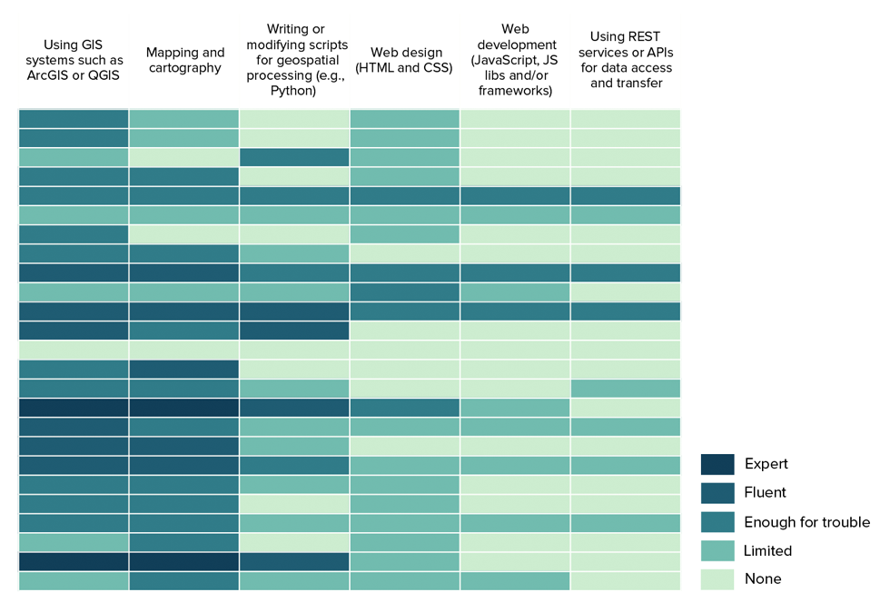

**Quick introductions:** Let's briefly go around the room and introduce ourselves.

### Open data and Open Data Day

We're here to celebrate Open Data through [Open Data Day 2018](http://opendataday.org/).

  
**Figure XX.** [Open Data Day 2018](http://opendataday.org/).

**Question:** What is Open Data?

## Finding and using open data

Obviously, we're not lacking in available data.

**A few open data sources**:

* https://data.world/
* https://www.data.gov/
* http://data.opengeoportal.org/
* http://www.naturalearthdata.com/downloads/
* https://www.census.gov/geo/maps-data/data/tiger-cart-boundary.html
* https://hub.arcgis.com/pages/open-data
* https://earthexplorer.usgs.gov/
* http://overpass-turbo.eu/
* https://download.geofabrik.de/
* http://sedac.ciesin.columbia.edu/
* http://www.opentopography.org/
* http://data.opengeoportal.org/

### The boring but important part: licenses

* https://project-open-data.cio.gov/open-licenses/
* http://opendefinition.org/guide/data/


## Introduction to open web mapping with Leaflet.js

Today we're going to briefly introduce you to open source web mapping. There are many exciting mapping tools and libraries to explore. We'll be using [Leaflet](http://leafletjs.com/), the "leading open-source JavaScript library for mobile-friendly interactive maps."

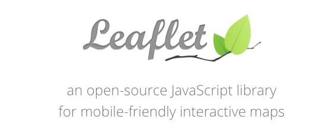  

Before we learn a little bit about making web maps with Leaflet, we need a "development environment.

### Codepen: a Web-based development environment

Typically web designers, developers, and mappers build applications using a [local development environment](https://github.com/rgdonohue/web-mapping-short-course/blob/master/module-01/lesson-01.md#setting-up-a-development-environment) that includes powerful text editors or integrated development environments (IDEs), local web servers, modern web browsers with sophisticated development and debugging tools, and more.

To simplify things today, however, we'll use a development environment housed entirely with the web browser called [CodePen](https://codepen.io/). Dubbed a "a social development environment for front-end designers and developers," CodePen allows us to import various resources from the web and write our own code to practice web mapping.

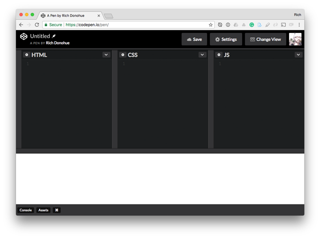
**Figure XX.** Codepen development interface.

You can create a new account to use Codepen, but it's easier to simply login using your GitHub credentials (recommended).

Let's get started learning a little bit about web development using Codepen. Login to your Codepen account and choose the option to create a "New Pen."

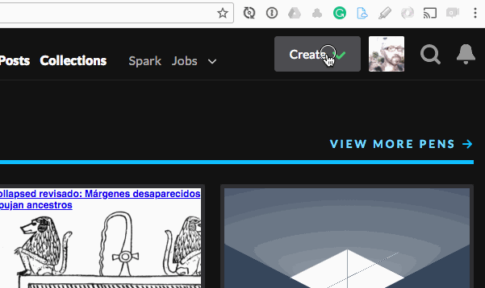
**Figure XX.** Creating a New Pen.

We're now ready to write a little HTML, CSS, and JavaScript.

### Building blocks of web design: HTML, CSS, JS

The designer Paul Rand once wrote that, "Design is the method of putting form and content together." He may have been speaking more of static logo design. Today, we can apply this idea to the design of interactive and dynamic web maps and data visualizations.

#### HTML (content)

We write HTML to structure the content of our pages and application. Begin by pasting the following HTML into the leftmost pane within your new Codepen Pen:

```html
<header>
  <div class="container">
    <h1>map title</h1>
    <h2>subtitle</h2>
  </div>
</header>
<div class="container">
  <div id="map"></div>
 </div>
<footer>
  <div class="container">
    <ul>
      <li>meta data <a href="">source</a> info</li>
      <li>meta author, etc</li>
    </ul>
  </div>
</footer>
```

As you can see, Codepen automatically updates the "browser" window at the bottom (you can also hit Save at the top or Cntr-S to save and refresh the window).

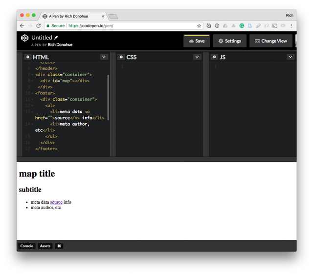

**Task:** Play around with the HTML within Codepen. Change the values of the text.

We have a valid HTML document now, but it's not very pretty (or useful) to look at. We need to marry some form to this content.
#### CSS (form)

Next, past the following CSS style rules in the second pane:

```css
@import url("https://fonts.googleapis.com/css?family=Lato:400,400i,700");
body {
  background: whitesmoke;
  font-family: Lato;
  color: #2d2d2d;
}
header {
  background: #00643b;
  color: #d4edda;
  padding: 18px 0;
}
footer ul {
  list-style-type: none;
  padding-left: 0;
}
footer li {
  margin-bottom: 6px;
}
footer a {
  color: #00643b;
}
h1 {
  margin: 0 48px 0 0;
  display: inline;
  font-weight: 400;
}
h2{
  display: inline;
  font-weight: 400;
}
.container {
  max-width: 960px;
  margin: 0 auto;
}
#map {
  width: 100%;
  height: 500px;
  margin: 24px 0;
  background: #448ee4;
}
```

Upon saving and updating, you should see the rendered HTML elements update with various style rules:

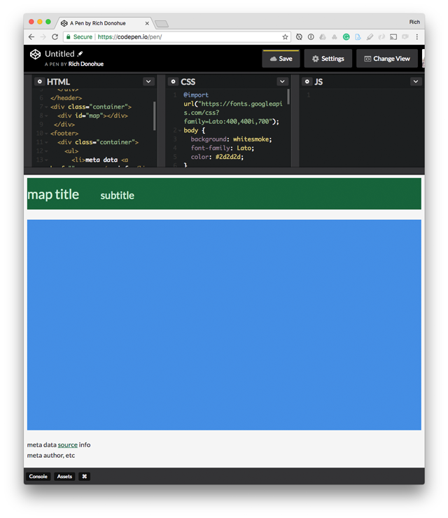

**Task:** Try playing around with the values of the style rules. Change the colors of the elements. Try adjusting the margins or sizes of the elements.

This is fun. Here we have an interactive environment for playing with the relationship between content and form. But the web offers us one more crucial component of design which we need to add to Paul's formula: behavior and interaction. This is where our JavaScript enters the love triangle.

#### JavaScript (behavior and events)

To quickly demonstrate the power of JavaScript, we're going to paste in a JavaScript statement that selects an existing element on our page and dynamically changes it. Write or paste the following JavaScript code into the third pane of the Codepen interface:

```javascript
document.querySelector("h1").innerHTML = "world's best map title"
```

As you can see, the JavaScript code is able to change the content of the HTML.

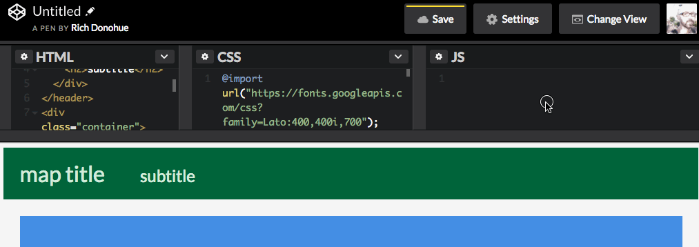

JavaScript is also able to change the form or styles of the HTML elements. Try writing or pasting the following JS code to change the color of the "map" element (values can be common color names or hexadecimal values):

```javascript
document.querySelector("#map").style.background = '#ffa950'
```

We can see how JavaScript can change the styles.

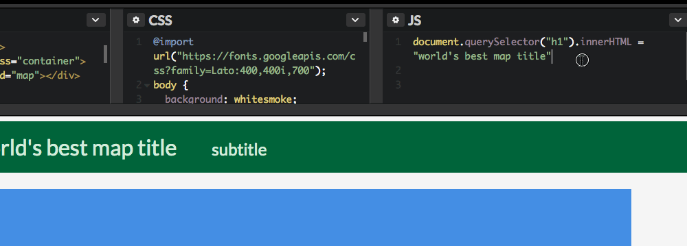

All together HTML, CSS, and JavaScript form the foundation for web mapping. Of course, there are many more web standards that come into play (particularly SVG, HTML's counterpart for describing graphics). But this should be enough to get us into trouble for the time being.

Next, let's use JavaScript to create a basic Leaflet web map and load some open data tiles from a remote resource.

### Creating a basic Leaflet map with open map tiles

Before we can use Leaflet within our web application, we need to load a couple external resources into our Pen. If you navigate to the [Leaflet Download page](http://leafletjs.com/download.html), you'll see Leaflet hosts the required CSS and JavaScript on remote CDN's (or Content Delivery Networks). 

Note there is a file containing Leaflet's CSS rules (ending with the extension `.css`) and a file containing Leaflet's JavaScript (ending with the extension `.js`):

```html
<link rel="stylesheet" href="https://unpkg.com/leaflet@1.3.1/dist/leaflet.css" />
<script src="https://unpkg.com/leaflet@1.3.1/dist/leaflet.js"></script>
```

We need to first add references to these resources. Within the Codepen interface, access the Pen Settings and paste the URL for the CSS into the CSS tab. Note that you just want to paste the URL: `https://unpkg.com/leaflet@1.3.1/dist/leaflet.css`

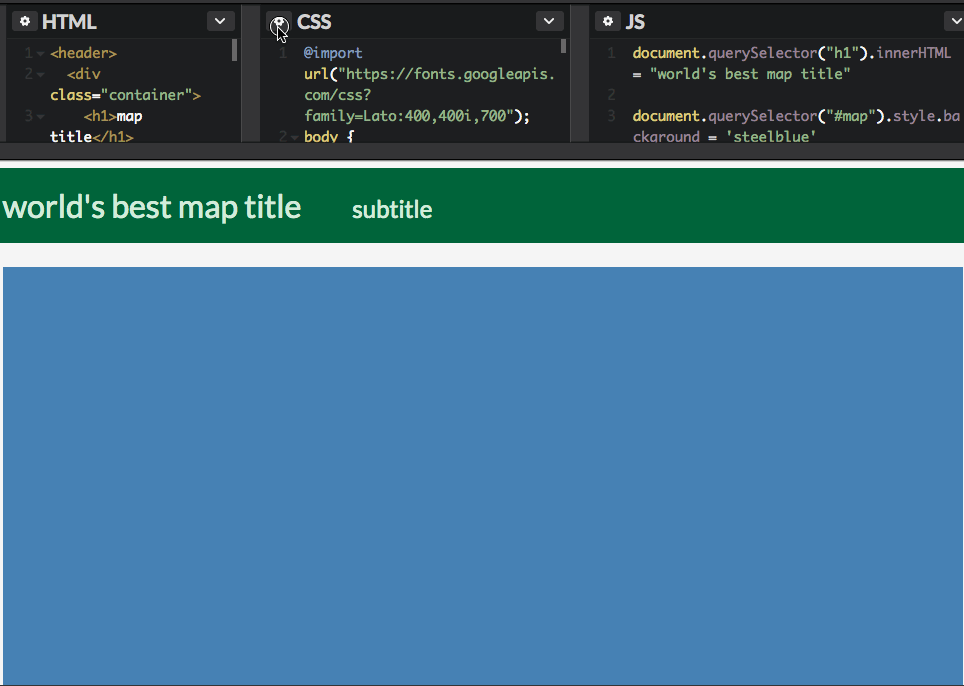

Then do the same thing for the JavaScript: `https://unpkg.com/leaflet@1.3.1/dist/leaflet.js`

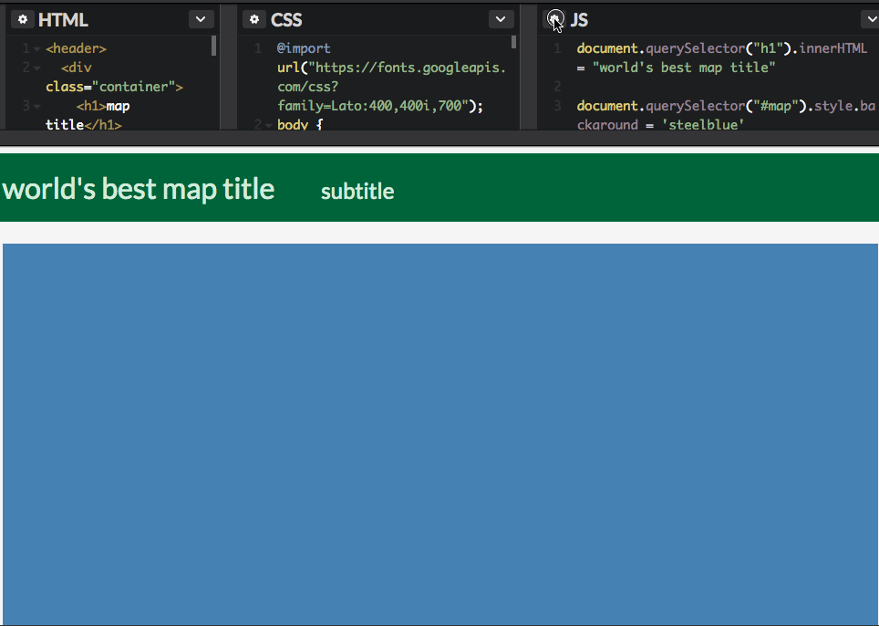

We should now be ready to go.

Replace the JavaScript we've already written with the following (note how the code following the two `//` forward slashes are comments that do not get executed when the JavaScript runs);

```javascript
//define map options
var options = {
  center: [40.57, -105.08], // lon, lat
  zoom: 11,  // initial zoom level 
}

// create Leaflet map with options
var map = L.map("map", options)

// request raster basemap tiles
var tiles = L.tileLayer('https://{s}.tile.opentopomap.org/{z}/{x}/{y}.png', {
	maxZoom: 17,
	attribution: 'Map data: &copy; <a href="http://www.openstreetmap.org/copyright">OpenStreetMap</a>, <a href="http://viewfinderpanoramas.org">SRTM</a> | Map style: &copy; <a href="https://opentopomap.org">OpenTopoMap</a> (<a href="https://creativecommons.org/licenses/by-sa/3.0/">CC-BY-SA</a>)'
})

// add the tiles to the map
tiles.addTo(map)
```

If successful, you should see your colored square for our "map" element replaced by a tiled Leaflet-supported slippy map using map tiles from opentopomap.org.

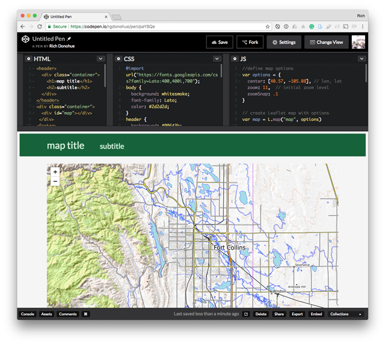

Hurray! You've made your first open web map using open data map tiles.

While we're not going to get deep into writing JavaScript, note the code stored as our `mapOptions`:

```javascript
//define map options
var options = {
  center: [40.57, -105.08], // lon, lat
  zoom: 11,  // initial zoom level 
}
```

**Task:** Try adjusting the numeric values for the latitude and longitude of the center of the map, as well as the initial zoom level (0 - 17).

We now have a basic map page template to work with moving forward. If you break your page playing with the HTML/CSS/JavaScript (which you should do), you can access it here:

https://codepen.io/rgdonohue/pen/wyOoyr

You can choose to "Fork" this Pen into your own account for further editing.

### Playing with Layers

Let's now explore some other options for these openly accessible map tiles. Navigate your browser to the following URL:

http://leaflet-extras.github.io/leaflet-providers/preview/

This page provides access to many available map tiles. Clicking on the tile options to the right will supply you with the JavaScript code necessary to request the new tile set. You can then cut and paste this code into your pen, replacing the existing tile layer with the new one.

For instance, we can replace this code within our Pen:

```javascript
L.tileLayer('https://{s}.tile.opentopomap.org/{z}/{x}/{y}.png', {
	maxZoom: 17,
	attribution: 'Map data: &copy; <a href="http://www.openstreetmap.org/copyright">OpenStreetMap</a>, <a href="http://viewfinderpanoramas.org">SRTM</a> | Map style: &copy; <a href="https://opentopomap.org">OpenTopoMap</a> (<a href="https://creativecommons.org/licenses/by-sa/3.0/">CC-BY-SA</a>)'
})
```
With the following code to produce a grayscale version of the tiles.

```javascript
L.tileLayer('http://{s}.tiles.wmflabs.org/bw-mapnik/{z}/{x}/{y}.png', {
	maxZoom: 18,
	attribution: '&copy; <a href="http://www.openstreetmap.org/copyright">OpenStreetMap</a>'
})
```

Saving those changes to our code will produce a new basemap:

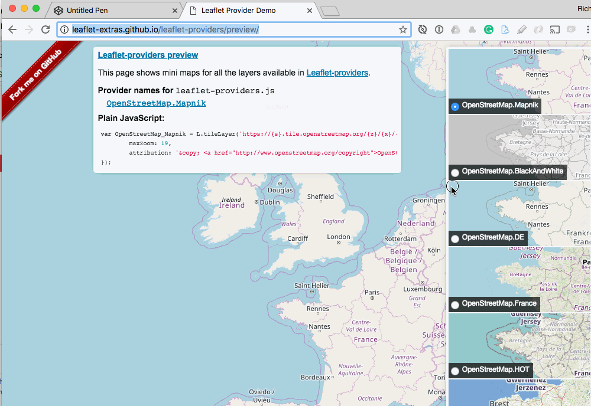

**Task:** Experiment with swapping our various basemaps listed within the Leaflet Providers demo page.

###

Resources: 

* [Esri Leaflet](https://github.com/Esri/esri-leaflet) (Leaflet plugins for working with a handful of the most popular ArcGIS Service types.)